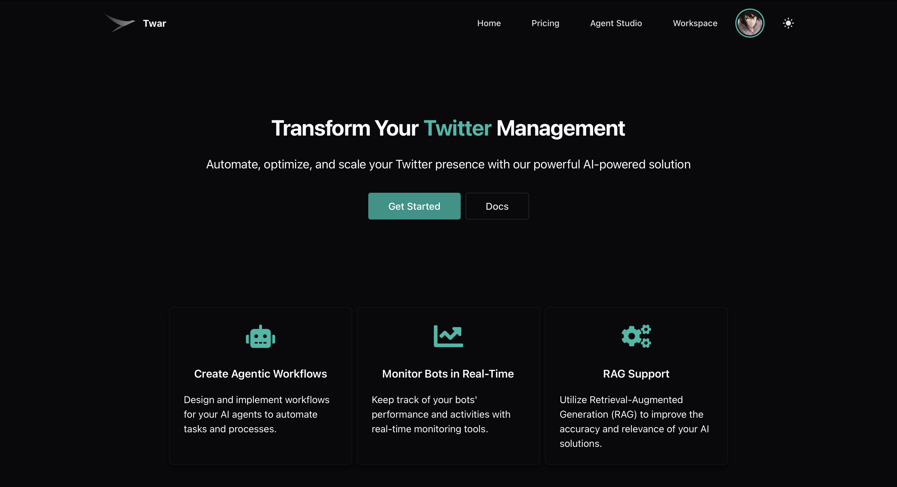
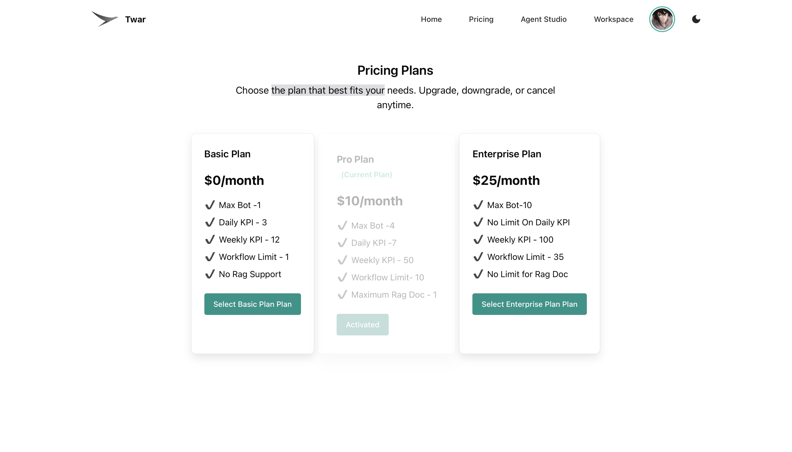
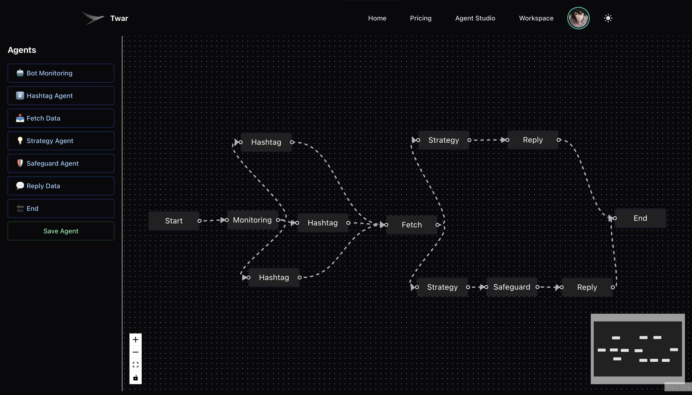
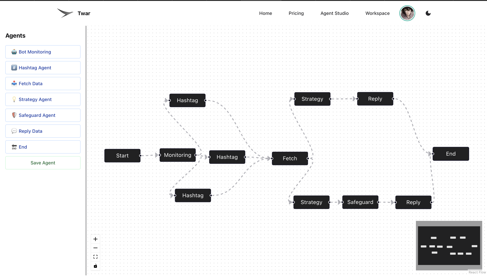
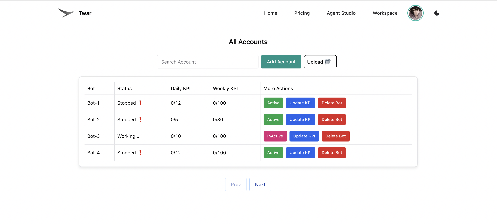
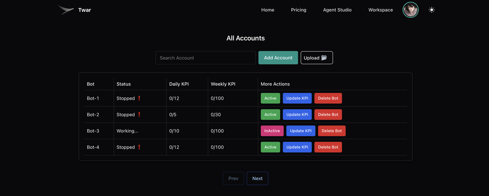
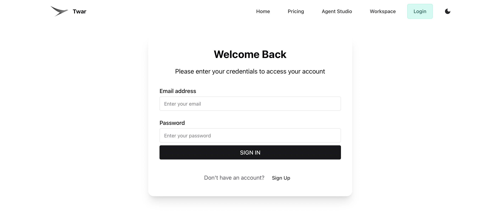
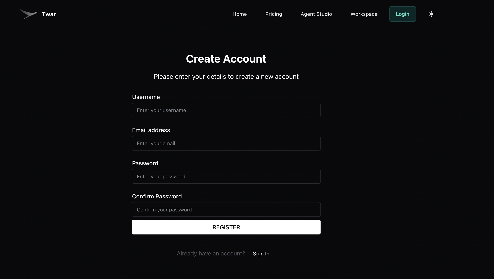

# Twar — The Agentic Twitter Marketing Suite


---

## 🚀 Overview

**Twar** is an **agentic AI-powered platform** designed to manage and automate Twitter accounts.  
It helps companies **promote their brand** intelligently by **monitoring hashtags**, **fetching relevant tweets**, and **replying contextually** — all while following safety rules.

Twar allows you to:
- Build **autonomous multi-agent workflows**
- Connect multiple **Twitter accounts (Bots)**
- Upload **knowledge documents** for context-aware replies (RAG-based)
- Track bot performance and automate engagement safely

---

## ✨ Features

- **Agentic System:** Compose multiple agents like Start → Monitor → Hashtag → Fetch → Strategy → Safeguard → Reply → End  
- **Bot Dashboard:** Monitor, activate, and track multiple accounts in real-time  
- **RAG Integration:** Retrieve company knowledge for intelligent replies  
-  **Custom Workflows:** Define your own workflow graph via Agent Studio  
- 🔒 **Authentication:** Secure login/register using JWT  
- 💬 **AI-Driven Replies:** LLM-powered contextual tweet engagement  

---

## 📸 Project Overview

### 🏠 Home Page
A simple and elegant landing page for Twar.  


---

### 💰 Pricing
Choose between **Free**, **Pro**, or **Enterprise** plans — each with different features and limits.  


---

### 🧩 Agent Studio
Build and visualize your **custom agent workflows** in an intuitive drag-and-drop interface. 

  


---

### 🤖 Accounts (Bots)
Manage your connected Twitter accounts:
1. Add or remove Twitter accounts  
2. Upload RAG knowledge documents  
3. Activate/deactivate accounts  
4. Track daily and weekly KPIs  
5. Search and filter bots  
6. View real-time status  

  


---

### 🔐 Login / Registration
Secure authentication system for managing your access.  
  


---

## 🧠 Architecture Overview

Frontend (React 18 + Node.js 22.12 + chakra 3)\
↓\
Backend (Flask + MySQL + ChromaDB)\
↓\
AI Layer (Ollama / Llama3 + Agentic Orchestration)\
↓\
Twitter APIs (Tweet Fetching, Replying, Monitoring)


---

## ⚙️ Local Setup Guide

### 🧩 Prerequisites
Ensure the following are installed:
- 🐍 Python **3.12**
- 🧠 Node.js **22.12**
- 💾 MySQL + ChromaDB running locally or via Docker
- Note : Run Mysql, ChromaDB on default config

---
### 🛠️ Local Setup Follow these steps to set up the project locally: 


1. **Clone the Repository** 
   Clone the project to your local machine:
   ```sh
   git clone https://github.com/souhardswami/Twar.git
   cd twar
2. **Use Backend Folder**
   Move to twar/backend Folder
   ```sh
   cd backend/ 
3. **Create a Virtual Environment** 
   Set up a Python virtual environment: 
   ```sh
   python -m venv myenv
   source myenv/bin/activate
4. **Install Dependencies**
   Install the required Python packages:
   ```sh 
   pip install -r backend/requirements.txt 
5. **Set Up Environment Variables** 
   Create a .env file in the backend directory and configure the required environment variables (e.g., Twitter API keys, database credentials for mysql and Chroma vector DB). 
   
6. **Run the Flask Application** 
   Start the backend server: machine:
   ```sh
   cd backend
   python app.py
## Frontend  
   Based on Nodejs (22.12) and React 18

1. **Use Frontend Folder**
   Move to twar/frontend Folder
   ```sh 
   cd twar/frontend 
2. **Download Node Module** 
   Download all the node.js package
   ```sh 
   npm install 
3. **Run application**
   ```sh 
   npm run start 
4. **Access UI** 
   http://localhost:3000


## 🧠 Agentic System Overview

The **Agentic System** in **Twar** enables **autonomous reasoning and execution** for Twitter automation.  
Each agent acts independently — capable of retrieving, analyzing, and taking actions using defined tools and contextual memory.

---

### 🧩 How It Works

1. **User Creates a Flow**  
   Each flow defines a logical sequence of agents to achieve a goal (e.g., "Find trending tweets and comment intelligently").

2. **Flow Steps**  
   Each step is powered by an *Agent*:
   - 🔍 **Retriever Agent** – Finds relevant tweets or topics.  
   1. Bot Monitoring
   2. Hashtag 
   3. Fetch Data
   4. Strategy 
   5. SafeGuard 
   6. Reply
   - 💬 **Comment Generator Agent** – Uses RAG (Retrieval-Augmented Generation) to write meaningful replies.  
   - 🚀 **Action Agent** – Posts or engages directly on Twitter.

3. **Memory & Context**  
   Agents share intermediate outputs through memory, enabling smooth handover between steps.

4. **Dynamic Tool Access**  
   Agents choose which tools to use (e.g., `fetch_tweeter_data`, `generate_comment`, `reply_on_tweet`) depending on live workflow context.


**🧑‍💻 Contributors**

Souhard Swami – Creator & Developer

**📜 License**
This project is licensed under the MIT License – feel free to use and modify it.
